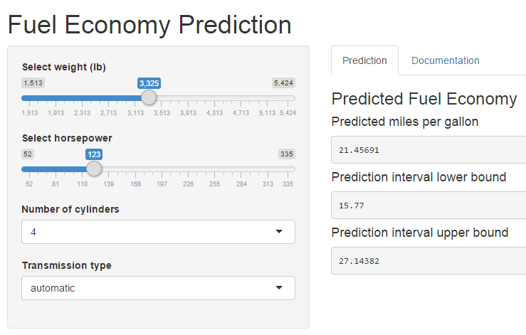

## The Problem

- As demand increases for fuel efficient cars, automobile designers need to know how to meet this demand without sacrificing other features, such as performance, luxury, cargo space, etc.

- Therefore, one needs to know what factors contribute to fuel efficiency, and quantify their impact.

--- 

## The Model

- A linear model was built to make the predictions, which identifies weight, horspower, number of cylinders, and transmission type as the most important factors in determining fuel economy.

$$MPG_i = \beta_0 + \beta_1 transmission_i + \beta_2 weight_i + \beta_3 cylinders_i + \beta_4 horsepower_i + e_i$$

- Coefficients (betas)


```
## (Intercept)    ammanual          wt        cyl6        cyl8          hp 
## 33.70832390  1.80921138 -2.49682942 -3.03134449 -2.16367532 -0.03210943
```

- R-squared


```
## [1] 0.8658799
```

---

## Why Use This App?

- This model is cumbersome for a designer to use when comparing possible design parameters for a new car.

- MPG prediction calcluation for an automatic, 3,325 lb. car, with 4 cylinders, and 123 hp
$$\hat{MPG} = \beta_0 + \beta_1 (0) + \beta_2 (3.325) + \beta_3 (0) + \beta_4 (0) + \beta_5 (123)$$

```r
mpg_hat <- fit$coeff[1] + fit$coeff[2] * 0 + fit$coeff[3] * 3.325 + fit$coeff[4] * 0 + fit$coeff[5] * 0 + fit$coeff[6] * 123
mpg_hat
```

```
## (Intercept) 
##    21.45691
```

- Rather, it would be nice if these predictions could be made quickly with an intuitive graphical user interface and a measure of uncertainty.

- The Shiny App does just this.

---

## Try It Out


[https://keithgw.shinyapps.io/Hello-Shiny/](https://keithgw.shinyapps.io/Hello-Shiny/)


